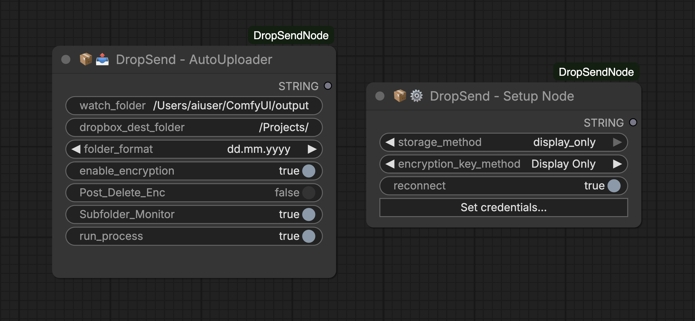

# ComfyUI DropSend Node (ComfyUI to Dropbox)

Automatically upload your ComfyUI output files to Dropbox with optional encryption. Set it and forget it.

> **Prefer Google Drive?** Check out [DriveSend Node](https://github.com/machinepainting/ComfyUI_DriveSendNode)



---

## How It Works

```
┌─────────────────────────────────────────────────────────────────────────────┐
│                         CLOUD (RunPod, etc.)                                │
│                                                                             │
│      ComfyUI generates files ──→ DropSend Node ──→ Uploads to Dropbox       │
│        (png, mp4, etc.)         │                                           │
│                                 │                                           │
│                                 ▼                                           │
│                      ┌──────────────────────┐                               │
│                      │ Encryption OPTIONAL  │                               │
│                      │ ☐ OFF: file.png      │                               │
│                      │ ☑ ON:  file.png.enc  │                               │
│                      └──────────────────────┘                               │
└─────────────────────────────────────────────────────────────────────────────┘
                                    │
                                    ▼
                               ☁️ DROPBOX
                                    │
                                    ▼
┌─────────────────────────────────────────────────────────────────────────────┐
│                           YOUR LOCAL MACHINE                                │
│                                                                             │
│   Dropbox syncs/downloads ──→ If encrypted: Run decrypt script (local)      │
│                                             ──→ file.png (viewable!)        │
│                                                                             │
│                               If not encrypted: Ready to use!               │
└─────────────────────────────────────────────────────────────────────────────┘
```

Encryption is optional. Leave `enable_encryption` off and files upload as-is.

---

## Two Nodes

### DropSend Setup Node
Runs once. Exchanges your Dropbox app credentials for a refresh token, then either writes them to `.env` (local installs) or shows them in a one-shot browser panel (cloud installs) so you can copy them into your platform's secrets manager.

### DropSend AutoUploader Node
Runs every workflow. Watches your ComfyUI output folder, optionally encrypts each new file, and uploads it to Dropbox. Supports `.png`, `.jpg`, `.jpeg`, `.webp`, `.gif`, `.mp4`, `.avi`, `.mov`. Includes SHA256 verification, queue-based retries, and optional subfolder monitoring.

---

## Installation

```bash
cd ComfyUI/custom_nodes/
git clone https://github.com/machinepainting/ComfyUI_DropSendNode.git
pip install -r ComfyUI_DropSendNode/requirements.txt
```

Restart ComfyUI after installation.

---

## Step 1: Create a Dropbox App

1. Log in to [Dropbox](https://www.dropbox.com/)
2. Open [Dropbox Developers](https://www.dropbox.com/developers/) and click **Create Apps**
3. Choose **Scoped Access** then **App Folder** (recommended)
4. Name your app and click **Create app**
5. On the **Permissions** tab, enable:
   - `account_info.write`, `account_info.read`
   - `files.metadata.write`, `files.metadata.read`
   - `files.content.write`, `files.content.read`
6. Click **Submit** to save permissions
7. On the **Settings** tab, copy your **App Key** and **App Secret**

> If "App Folder" is not selectable, create an `/Apps/` folder in your Dropbox root first.

---

## Step 2: Run the Setup Node

The Setup Node is gated behind an environment variable. This prevents a remote workflow from hijacking or wiping your credentials. Pick the section that matches where you run ComfyUI.

### A) Cloud (RunPod and similar)

**1. Set the gate.** Add this to your RunPod template's **Environment Variables**:

```
COMFYUI_DROPSEND_ALLOW_SETUP=1
```

Start (or restart) the pod. To verify, open a pod shell and run:

```bash
echo $COMFYUI_DROPSEND_ALLOW_SETUP    # should print: 1
```

**2. Add the Setup Node to your workflow.** Configure:

| Field | Value |
|---|---|
| `storage_method` | `display_only` (values shown in browser, never saved on the pod) |
| `encryption_key_method` | `Display Only` (or `off` if you do not want encryption) |
| `reconnect` | leave off |

**3. Click "Set credentials..."** on the node. A modal opens with three password fields:

| Field | What to paste |
|---|---|
| App Key | Your Dropbox App Key (from Step 1) |
| App Secret | Your Dropbox App Secret (from Step 1) |
| Auth Code | Leave blank for now |

Click **Save**. The modal closes.

**4. Click Queue (Run).** The node prints an OAuth URL. The URL is delivered three ways, use whichever works:

- A browser popup opens automatically (preferred)
- The ComfyUI terminal prints a `DROPSEND DROPBOX AUTHORIZATION REQUIRED` banner with the URL (Cmd or Ctrl click to open)
- Wire a `Show Text` node to the Setup Node's `STRING` output

**5. Authorize at Dropbox.** Open the URL, click Allow, and copy the authorization code Dropbox displays.

**6. Paste the auth code.** A second modal auto-opens for this. Paste your App Key, App Secret, and the new Auth Code. Click **Save**.

**7. Click Queue again.** A **DropSend Credentials** panel appears in your browser with four values:

| Value | Description |
|---|---|
| `DROPBOX_APP_KEY` | From your Dropbox app |
| `DROPBOX_APP_SECRET` | From your Dropbox app |
| `DROPBOX_REFRESH_TOKEN` | Long-lived token, just generated |
| `COMFYUI_ENCRYPTION_KEY` | Only if you chose to generate one |

Each value has a **Copy** button. There is also a **Copy all as NAME=value** button.

The panel is browser-only. Closing it discards the data and nothing is saved on the pod. If you close it before copying, just rerun the Setup Node to regenerate the values.

**8. Save the values to RunPod Secrets.** In RunPod, click **Secrets** in the sidebar and create:

| Secret Name (must match exactly) | Value |
|---|---|
| `DROPBOX_APP_KEY` | from the panel |
| `DROPBOX_APP_SECRET` | from the panel |
| `DROPBOX_REFRESH_TOKEN` | from the panel |
| `COMFYUI_ENCRYPTION_KEY` | from the panel (only if using encryption) |

**9. Add the secrets to your pod template.** Click **My Templates**, edit your template, and under **Environment Variables** add:

| Key | Value |
|---|---|
| `DROPBOX_APP_KEY` | `{{ RUNPOD_SECRET_DROPBOX_APP_KEY }}` |
| `DROPBOX_APP_SECRET` | `{{ RUNPOD_SECRET_DROPBOX_APP_SECRET }}` |
| `DROPBOX_REFRESH_TOKEN` | `{{ RUNPOD_SECRET_DROPBOX_REFRESH_TOKEN }}` |
| `COMFYUI_ENCRYPTION_KEY` | `{{ RUNPOD_SECRET_COMFYUI_ENCRYPTION_KEY }}` (optional) |

Save the template. The next time you deploy a pod from this template, ComfyUI will see the credentials automatically.

> You can now remove `COMFYUI_DROPSEND_ALLOW_SETUP=1` from the template unless you plan to re-run the Setup Node from this pod.

**10. Deploy a fresh pod from your template.** Skip to **Step 3**.

---

### B) Local install

**1. Set the gate in the same shell that will launch ComfyUI:**

```bash
# macOS / Linux
export COMFYUI_DROPSEND_ALLOW_SETUP=1

# Windows (Command Prompt)
set COMFYUI_DROPSEND_ALLOW_SETUP=1

# Windows (PowerShell)
$env:COMFYUI_DROPSEND_ALLOW_SETUP = "1"
```

Verify:

```bash
# macOS / Linux
echo $COMFYUI_DROPSEND_ALLOW_SETUP

# Windows (Command Prompt)
echo %COMFYUI_DROPSEND_ALLOW_SETUP%

# Windows (PowerShell)
echo $env:COMFYUI_DROPSEND_ALLOW_SETUP
```

Each command should print `1`. Now launch ComfyUI from that same shell.

**2. Add the Setup Node to your workflow.** Configure:

| Field | Value |
|---|---|
| `storage_method` | `env_file` (values written to `.env`, mode `0600`, in the plugin directory) |
| `encryption_key_method` | `save to .env` (or `off`) |
| `reconnect` | leave off |

**3. Click "Set credentials..."** on the node. In the modal:

| Field | What to paste |
|---|---|
| App Key | Your Dropbox App Key |
| App Secret | Your Dropbox App Secret |
| Auth Code | Leave blank |

Click **Save**.

**4. Click Queue.** The node prints an OAuth URL. Open it, authorize at Dropbox, and copy the auth code.

**5. Paste the auth code.** A second modal auto-opens. Paste App Key, App Secret, and Auth Code. Click **Save**.

**6. Click Queue again.** Credentials are written to `.env` in the plugin directory and loaded into the running ComfyUI process. No restart needed.

> Once setup is complete, you can drop `COMFYUI_DROPSEND_ALLOW_SETUP` from your environment. The AutoUploader does not need it.

---

## Step 3: Use the AutoUploader

1. Add the **DropSend AutoUploader Node** to your workflow.
2. Configure:

| Field | What it does |
|---|---|
| `watch_folder` | Folder to monitor for new files (defaults to ComfyUI output, see clamp note in Security section) |
| `dropbox_dest_folder` | Destination folder in Dropbox (must start with `/Apps/...`) |
| `folder_format` | Append today's date to the destination, or use the literal name |
| `enable_encryption` | If true, encrypts each file with AES (Fernet) before uploading |
| `Post_Delete_Enc` | After upload, delete the local `.enc` file |
| `Subfolder_Monitor` | Recursively watch subfolders |
| `run_process` | Set to `True` to start uploading |

3. Run a workflow that generates an image. The AutoUploader picks it up, optionally encrypts it, uploads it to Dropbox, and prints status to the ComfyUI console.

---

## Decryption (Local Use Only)

If you uploaded with `enable_encryption=True`, files arrive in Dropbox as `filename.ext.enc`. Decrypt them on your local machine after downloading.

> **Decrypt files only after they have been moved to your local computer or external drive.** Decrypting on the cloud pod defeats the purpose of encrypting before upload.

### Install the decrypt dependency

```bash
pip install cryptography
```

### Store your encryption key locally

**macOS (Keychain):**
1. Open Keychain Access, choose File then New Password Item.
2. Name: `ComfyUI_Encryption_Key`. Account: `ComfyUI`. Password: your key.

**Windows:**
1. Press `Win + R`, run `sysdm.cpl`, open **Advanced**, click **Environment Variables**.
2. Under **User variables**, click **New**. Name: `COMFYUI_ENCRYPTION_KEY`. Value: your key.

**Linux:**
```bash
echo 'export COMFYUI_ENCRYPTION_KEY="your_key_here"' >> ~/.bashrc
source ~/.bashrc
```

### Run the decrypt script

1. Open the `/scripts/` folder in this repository and pick your platform:

   | Platform | File |
   |---|---|
   | macOS | `mac/decrypt_folder_mac.sh` |
   | Windows | `win/decrypt_folder_win.py` |
   | Linux | `linux/decrypt_folder_linux.sh` |
   | Cross-platform | `decrypt_folder.py` (Python) |

2. Save the script to a convenient location (your home folder works well).

3. Open a terminal in that location and run:

   ```bash
   # macOS
   ./decrypt_folder_mac.sh

   # Linux
   ./decrypt_folder_linux.sh

   # Windows
   python decrypt_folder_win.py

   # Cross-platform Python
   python decrypt_folder.py
   ```

4. When prompted, drag in (or paste the path to) the folder containing your `.enc` files.

5. The script decrypts each file alongside the original. Once finished, you are asked whether to move the `.enc` originals into a separate cleanup folder. Originals are never deleted automatically.

> Each platform folder also contains an encryption script if you ever want to encrypt files manually outside of ComfyUI. The node itself handles encryption automatically during upload.

---

## Troubleshooting

### Files are not uploading
- Set `run_process` to `True`.
- Check the ComfyUI console for upload errors.
- Confirm the destination folder starts with `/Apps/`.

### "Encryption key not found"
- Confirm the secret name is exactly `COMFYUI_ENCRYPTION_KEY`.
- Verify the env var is set in the pod template (then restart the pod).

### "Setup is disabled" or "Reconnect refused"

The Setup Node prints this when `COMFYUI_DROPSEND_ALLOW_SETUP=1` is not visible to the running ComfyUI process. Stop ComfyUI, set the variable in the same terminal you launch from, verify it, and start ComfyUI again.

```bash
# macOS / Linux
export COMFYUI_DROPSEND_ALLOW_SETUP=1
echo $COMFYUI_DROPSEND_ALLOW_SETUP    # prints: 1
```

```cmd
:: Windows (Command Prompt)
set COMFYUI_DROPSEND_ALLOW_SETUP=1
echo %COMFYUI_DROPSEND_ALLOW_SETUP%
```

```powershell
# Windows (PowerShell)
$env:COMFYUI_DROPSEND_ALLOW_SETUP = "1"
echo $env:COMFYUI_DROPSEND_ALLOW_SETUP
```

For RunPod or Docker, add the variable to the pod template and restart.

> The variable must be set in the **same shell that launches ComfyUI**. Setting it in one terminal and starting ComfyUI from a different one (or via Pinokio, ComfyUI Desktop, a launcher script, etc.) will not work. Adding it to `~/.bashrc` or `~/.zshrc` and opening a fresh terminal also works.

### "Browser delivery refused"

The Setup Node printed this because your prompt was submitted without a `client_id` (typical for `curl` or SDK submissions that omit it). Submitting that way would broadcast credentials to every connected WebSocket client, so the node refuses. Submit the Setup workflow from the ComfyUI web UI instead, or switch `storage_method` to `env_file` to write to disk.

### Browser panel did not appear after `display_only` setup
- Re-run the Setup Node. Credentials are not stored on the pod in this mode, so the panel is the only retrieval path and it regenerates on each run.
- Check the browser's popup or panel blocker.
- If it still does not appear, switch `storage_method` to `env_file` and `cat` the `.env` file from a shell.

### Authorization failed
- Confirm `COMFYUI_DROPSEND_ALLOW_SETUP=1` is set (see above).
- Re-run the Setup Node with `reconnect=True` to clear stale state, then retry.
- Generate a fresh auth code from Dropbox.

---

## Security Best Practices

1. **Never commit your `.env` file.** It is already in `.gitignore`.
2. **Back up your encryption key.** Without it, encrypted files cannot be recovered.
3. **Prefer Keychain or environment variables** over plaintext storage of the key.
4. **Bind ComfyUI to localhost or front it with an authenticating proxy.** ComfyUI's `/prompt` endpoint accepts any submission unauthenticated; on a publicly-reachable host that means anyone can queue workflows on your machine. Either bind to `127.0.0.1` (default) and tunnel in via SSH/VPN, or place ComfyUI behind a reverse proxy that enforces HTTP basic auth or OAuth. The DropSend protections layered on top assume the operator is the only person with workflow-submit access; without that, the `COMFYUI_DROPSEND_ALLOW_SETUP` gate is your last line of defense.

### Encryption key rotation

The Fernet key in `COMFYUI_ENCRYPTION_KEY` is symmetric: the same key encrypts and decrypts. Practical implications:

- **Old `.enc` files cannot be decrypted with a new key.** If you rotate the key while previously-encrypted files still live in your Dropbox, those files become permanently unreadable unless you keep the old key on hand (e.g. in a labelled backup). Decide before rotating: re-download and re-encrypt against the new key, accept the loss, or stash the old key in a labelled secrets vault entry (e.g. `COMFYUI_ENCRYPTION_KEY_2025_archive`).
- **A leaked key compromises everything encrypted under it.** If you suspect the key has been exposed (committed to git, pasted into a chat, etc.), generate a fresh key, re-encrypt files you need going forward, and delete or replace the old `.enc` files in Dropbox. The leaked key remains valid for any copy of the old files an attacker may already have.
- **Generating a new key.** Re-run the Setup Node with `encryption_key_method = Display Only` (or `save to .env`). Each run generates a fresh `Fernet.generate_key()`. Copy the new value into your secrets store and restart the pod.

#### Recovering files encrypted with an old key

If you have `.enc` files that were encrypted with an older key (whether you rotated deliberately or are upgrading from v1.0.x), this is the recovery process:

1. **Locate the old key.** Wherever you stored it: password manager, secrets vault, old `.env` file, screenshot of the original Setup Node output panel. The Fernet key looks like `Q2xVZi1...rjs=` (Base64, 44 characters).
2. **Download the `.enc` files locally.** Don't decrypt on the cloud pod, that re-introduces the plaintext to the pod's filesystem.
3. **Set the OLD key as `COMFYUI_ENCRYPTION_KEY` in your local shell**:

   ```bash
   # macOS / Linux (one-shot, just for the decrypt session)
   export COMFYUI_ENCRYPTION_KEY="<paste old key here>"
   ```
   ```cmd
   :: Windows Command Prompt
   set COMFYUI_ENCRYPTION_KEY=<paste old key here>
   ```

4. **Run the decrypt script** from the [Decryption section](#decryption-local-use-only) above against the folder of `.enc` files. The script reads `COMFYUI_ENCRYPTION_KEY` from the environment, so whichever key is currently set is the one used.
5. **(Optional) Re-encrypt with the new key.** If you want the recovered files re-uploaded to Dropbox under the new key, swap `COMFYUI_ENCRYPTION_KEY` to the new value and run the matching encrypt script in `scripts/<platform>/`.
6. **Wipe the old key from your shell** when finished:

   ```bash
   unset COMFYUI_ENCRYPTION_KEY    # macOS / Linux
   set COMFYUI_ENCRYPTION_KEY=     # Windows cmd
   ```

If the old key was leaked (per the v1.1.0 advisory below) and you're recovering files only because you wanted them back: be aware that anyone with a copy of both the leaked key AND a copy of the `.enc` file can decrypt it. Re-uploading under a fresh key only protects the *new* uploads, not the old `.enc` files that were already in attacker-reachable storage.

### Uninstalling / disconnecting

When you stop using DropSend (uninstalling the plugin, decommissioning a pod, etc.), do these steps in order so leaked credentials cannot be reused:

1. **Disconnect the Dropbox app from your account.** Go to <https://www.dropbox.com/account/connected_apps>, find the app, and click **Disconnect**. This invalidates the refresh token at Dropbox; even a copy of the token sitting in someone's clipboard becomes useless. *(Running the Setup Node with `reconnect=True` does this automatically via the API — same effect, different trigger.)*
2. **Reset the app secret.** Go to <https://www.dropbox.com/developers/apps>, click your app → **Settings** → next to **App secret**, click **Show**, then **Reset**. This invalidates any cached secret that was paired with the (now-revoked) refresh token. Without both halves, no further token refresh is possible even if the old values were captured.
3. **Remove credentials from your platform's secrets store.** Delete `DROPBOX_APP_KEY`, `DROPBOX_APP_SECRET`, `DROPBOX_REFRESH_TOKEN`, and `COMFYUI_ENCRYPTION_KEY` from RunPod Secrets / Docker env / systemd EnvironmentFile / wherever they're configured. Restart the pod after removal so the env vars are no longer in process memory.
4. **Delete `.env`** from the plugin directory if you used `storage_method = env_file`.
5. **Decide what to do with previously-uploaded `.enc` files.** Files already in Dropbox under your account were encrypted by the operator who held `COMFYUI_ENCRYPTION_KEY`. If that key was leaked, anyone with the key can still decrypt the files. Delete files you don't need, or re-download and re-encrypt with a fresh key.

### Threat model for network-reachable ComfyUI hosts

If your ComfyUI is reachable over the network (RunPod, tunnels, LAN, public web UI), anyone who can submit a workflow can in principle set node inputs. To keep DropSend safe in that setting, the nodes enforce these protections.

- **`watch_folder` is clamped to the ComfyUI output directory.** The AutoUploader runs a recursive Watchdog observer that uploads everything it sees, so an unrestricted path would be an arbitrary-file-read primitive. By default, `watch_folder` must resolve inside the directory returned by `folder_paths.get_output_directory()`. To monitor an additional location, set `COMFYUI_DROPSEND_ALLOWED_WATCH_PATHS` on the host (`os.pathsep`-separated absolute paths) before starting ComfyUI. Workflow inputs cannot expand this list.

- **The Setup Node refuses to write or clear credentials unless explicitly opted in.** This is what `COMFYUI_DROPSEND_ALLOW_SETUP=1` enforces. A remote workflow submitter can send JSON to ComfyUI but cannot set environment variables on your machine, so the gate proves a human with host access opted in. The AutoUploader never needs this flag.

- **Setup Node secret fields are not workflow inputs.** `app_key`, `app_secret`, and `auth_code` do not appear in the node's `INPUT_TYPES`. They are entered only via a browser-only modal and POSTed to a same-origin route (`/dropsend/setup/stash`) that is gated on a live WebSocket session. They never enter the workflow JSON, PNG metadata, ComfyUI's localStorage auto-save, copy-pasted nodes, or the unauthenticated `/history` endpoint.

- **The stash route is hardened.** Same-origin check (the `Origin` header must match the request `Host`, blocking cross-origin CSRF from another tab), `Content-Type: application/json` requirement, live-session check (the supplied `client_id` must match a connected WebSocket), per-IP rate limit (30 POSTs per 10 seconds), 32 KB body cap, JSON validation, 32-entry capacity with 60-second TTL, lock-protected access, one-shot consumption when `setup()` runs.

- **Credentials never travel through the node's `ui` or `result` channels.** ComfyUI persists both into `PromptServer.history`, served on the unauthenticated `/history` HTTP endpoint. Instead the Setup Node delivers credentials via:
  - **`env_file`** (local installs only): values are written to `.env` in the plugin directory (mode `0600`, race-free open) and the node returns only a non-secret confirmation.
  - **`display_only`** (cloud or hosted ComfyUI): values are pushed to the originating browser session via a one-shot WebSocket message and rendered in a panel inside the workflow tab. Nothing is written to disk on the pod. The panel discards the data when closed.

- **WebSocket deliveries are sid-targeted, never broadcast.** ComfyUI's `send_sync(event, data, sid=None)` would broadcast to every connected client when `sid` is `None`. The Setup Node refuses to send credential or refresh notifications without a `client_id` and returns a clear "Browser delivery refused" message. As defense in depth, the originating `client_id` is echoed inside each WebSocket payload and the JS handler verifies it matches `api.clientId` before rendering the credentials panel.

- **Reconnect revokes the Dropbox refresh token at the source.** Running Setup with `reconnect=True` calls `POST /2/auth/token/revoke` against `api.dropboxapi.com` (8-second timeout) so the previously-issued refresh token cannot be reused even if it leaked out of band. Local cleanup proceeds regardless of revocation outcome.

- **Logging stores no secrets.** The plugin's `dropsend.log` records file paths, watcher events, and errors. No tokens, refresh tokens, app secrets, or encryption keys are written to logs or stdout in plaintext. The post-setup banner uses last-4-character redaction so values are not captured by stdout aggregators. The log uses `RotatingFileHandler` (5 MB per file, 3 backups) so it cannot grow unbounded; on a long-lived host disk usage is capped at roughly 20 MB.

### Additional considerations

- **`COMFYUI_DROPSEND_ALLOW_SETUP` is process-wide, not per-action.** Once set, every workflow submission in that ComfyUI process is unblocked, including hostile submissions during the setup window. Recommended discipline: set the gate, run Setup once, restart ComfyUI without the gate.

- **The OAuth authorization URL contains your Dropbox `app_key`.** Dropbox treats `app_key` as a public identifier (it appears in every authorization URL), but the URL string itself ends up in `/history` when the Setup Node returns it during the first run. This reveals which Dropbox app the host is paired with. It does not, on its own, allow access to your data.

- **Plain ComfyUI runs over HTTP.** The browser-only credential delivery in `display_only` mode rides the same WebSocket the rest of ComfyUI uses, in cleartext on the wire. On a network you do not fully trust, terminate ComfyUI behind HTTPS (reverse proxy, tunnel) before relying on this path. The most conservative alternative is to run the Setup Node on a local ComfyUI install and copy the values into your cloud secrets manager directly. Credentials never touch the cloud pod's filesystem or its network.

- **Multi-tenant hosts: the plugin directory listing is visible.** Plugin files are installed `0o755` (world-readable directory listing). The `.env` inside is `0o600` so its contents are protected, but other local users can run `ls` on the plugin dir and see that you have a `.env` (signaling "this user is paired with Dropbox"). Single-user machines are unaffected. On a multi-tenant box, set the plugin directory to `0o700` if your ComfyUI process runs as the only consumer, or accept the metadata leak.

- **Reconnect-revocation can fail silently if Dropbox is unreachable.** If `reconnect=True` cannot mint a fresh access token (network outage, refresh token already invalidated, etc.), local cleanup proceeds but the token at Dropbox stays alive. The failure is logged at `ERROR` level (`dropsend.log` and stdout) with explicit instructions to manually disconnect at <https://www.dropbox.com/account/connected_apps>. **Watch for the "Token revocation FAILED" line** when reconnecting; if you see it, finish the disconnect manually.

- **Dropbox SDK error messages may appear in `dropsend.log`.** When an upload or token-refresh call fails, the SDK exception is logged. Most failure modes don't include credential material, but reviewing the log before sharing it (e.g. with support) is good practice.

---

## Tested On

- macOS 13+ (Ventura, Sonoma)
- Python 3.10 / 3.11
- ComfyUI (May 2026)
- RunPod GPU instances

---

## Repository Structure

```
ComfyUI_DropSendNode/
├── __init__.py
├── dropsend_uploader_node.py
├── dropsend_setup_node.py
├── dropbox_upload.py
├── dropbox_auth_manager.py
├── encrypt_file.py
├── monitor_output.py
├── safe_paths.py
├── requirements.txt
├── README.md
├── .gitignore
├── web/
│   └── dropbox_oauth.js
└── scripts/
    ├── decrypt_folder.py
    ├── mac/
    │   ├── decrypt_folder_mac.sh
    │   └── encrypt_folder_mac.sh
    ├── win/
    │   ├── decrypt_folder_win.py
    │   └── encrypt_folder_win.py
    └── linux/
        ├── decrypt_folder_linux.sh
        └── encrypt_folder_linux.sh
```

---

## Changelog

### v1.1.1 — Docs

Documentation-only release. No code or behavior changes. Published to ship the README delta to the Comfy Registry, since registry versions are immutable once published.

- **New "Recovering files encrypted with an old key" subsection** under Encryption key rotation — step-by-step recovery procedure for `.enc` files encrypted under a previous key (including the v1.1.0 advisory case).
- **Header image refreshed** to show the new node UI (modal-based credential entry, no more text fields).

### v1.1.0 — Setup Node refactor + security hardening

**Security fixes (advisory):** earlier versions of the Setup Node accepted `app_key`, `app_secret`, and `auth_code` as workflow inputs and delivered credentials over a `send_sync(event, data)` call without an explicit `sid` argument. On ComfyUI hosts reachable over a network, both paths leaked credentials:

- **WebSocket broadcast.** When `PromptServer.client_id` was `None` (typical for CLI/API submissions that omit `client_id`), `send_sync(..., None)` broadcast credential payloads to every connected browser tab on the same instance.
- **Workflow persistence.** `app_key`/`app_secret`/`auth_code` typed into the node's text fields were serialized into saved workflow JSON, ComfyUI's localStorage auto-save, embedded PNG metadata of any image generated during the session, copy-pasted nodes, and the unauthenticated `/history` HTTP endpoint.

If you ran a previous version of the Setup Node on a network-reachable host, treat the corresponding `app_key` / `app_secret` / `refresh_token` as compromised: revoke the Dropbox app, reset the app secret, and re-issue a refresh token. See **Uninstalling / disconnecting** above.

**v1.1.0 closes both vectors via:**
- Removing `app_key` / `app_secret` / `auth_code` from the Setup Node's `INPUT_TYPES` entirely. Credentials are now entered through a browser-only modal that POSTs to a same-origin route, and never become workflow inputs at any layer.
- Refusing to call `send_sync` for credential events when `client_id` is `None`. Defense in depth: the `client_id` is echoed inside each WebSocket payload and verified by the JS handler against `api.clientId` before rendering the credentials modal.
- Hardening the new `/dropsend/setup/stash` route with a live-WebSocket-session check, per-IP rate limit, body cap, and 60-second TTL on stashed entries.
- Revoking the Dropbox refresh token at the source on `reconnect=True` (8-second timeout, local cleanup proceeds regardless).

**Other changes in this release:**
- `folder_format` dropdown for AutoUploader (`project_name` default + five worldwide date formats).
- Single-Observer fix for the macOS `_fsevents` conflict that had prevented `.enc` files from being picked up by the upload watcher.
- Auto-trigger modal after Run 1 prints the OAuth URL banner.
- Branded `📦👀 / 📦🔐 / 📦📤` log emojis for watching/encrypted/sent.
- Centralized logging in `__init__.py` so log records actually persist to `dropsend.log`.

---

## License

MIT

---

Shout-out to Adam for his contributions to this node build.
