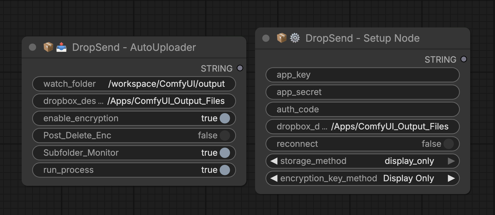

# ComfyUI DropSend Node (ComfyUI >> DropBox)

Automatically upload your ComfyUI output files to Dropbox with optional encryption. Set it and forget it!

> **Prefer Google Drive?** Check out [DriveSend Node](https://github.com/machinepainting/ComfyUI_DriveSendNode)



---

## 🔄 How It Works

```
┌─────────────────────────────────────────────────────────────────────────────┐
│                         CLOUD (RunPod, etc.)                                │
│                                                                             │
│      ComfyUI generates files ──→ DropSend Node ──→ Uploads to Dropbox       │
│        (png, mp4, etc.)         │                                           │
│                                 │                                           │
│                                 ▼                                           │
│                      ┌──────────────────────┐                               │
│                      │ Encryption OPTIONAL  │                               │
│                      │ ☐ OFF: file.png      │                               │
│                      │ ☑ ON:  file.png.enc  │                               │
│                      └──────────────────────┘                               │
└─────────────────────────────────────────────────────────────────────────────┘
                                    │
                                    ▼
                               ☁️ DROPBOX
                                    │
                                    ▼
┌─────────────────────────────────────────────────────────────────────────────┐
│                           YOUR LOCAL MACHINE                                │
│                                                                             │
│   Dropbox syncs/downloads ──→ If encrypted: Run decrypt script (local)      │
│                                             ──→ file.png (viewable!)        │
│                                                                             │
│                               If not encrypted: Ready to use!               │
└─────────────────────────────────────────────────────────────────────────────┘
```

**Encryption is completely optional.** Leave `enable_encryption` off and files upload directly as-is.

---

## 📤 Features

### DropSend AutoUploader Node
- Real-time folder monitoring with optional subfolder support
- Supports: `.png`, `.jpg`, `.jpeg`, `.webp`, `.gif`, `.mp4`, `.avi`, `.mov`
- Optional AES-128 encryption before upload
- SHA256 checksum verification
- Queue system for reliable uploads

### DropSend Setup Node
- Generates Dropbox refresh token from App Key/Secret
- Outputs credentials for RunPod environment variables
- Optional encryption key generation

### Decryption Scripts (Local Use)
- Cross-platform scripts for macOS, Windows, and Linux
- Decrypt `.enc` files after downloading from Dropbox

---

## 💾 Installation

```bash
cd ComfyUI/custom_nodes/
git clone https://github.com/machinepainting/ComfyUI_DropSendNode.git
pip install -r ComfyUI_DropSendNode/requirements.txt
```

Restart ComfyUI after installation.

---

## 🔧 Dropbox App Setup

1. Login to [Dropbox](https://www.dropbox.com/)
2. Go to [Dropbox Developers](https://www.dropbox.com/developers/) → Click **Create Apps**
3. Select **Scoped Access** → **App Folder** (recommended)
4. Name your app → Click **Create app**
5. Go to **Permissions** tab and enable:
   - `account_info.write`, `account_info.read`
   - `files.metadata.write`, `files.metadata.read`
   - `files.content.write`, `files.content.read`
6. Click **Submit** to save permissions
7. Go to **Settings** tab → Note your **App Key** and **App Secret**

> **Note:** If you can't select App Folder, create an `/Apps/` folder in your Dropbox root first.

---

## 🏃‍♂️ DropSend Setup (RunPod & Cloud Users)

### Step 1: Run Setup Node

1. Add **DropSend Setup Node** to your workflow
2. Configure:
   - `app_key`: Paste your App Key
   - `app_secret`: Paste your App Secret
   - `auth_code`: Leave blank (for now)
   - `dropbox_dest_folder`: `/Apps/ComfyUI_Output_Files` (or your choice)
   - `storage_method`: **display_only**
   - `encryption_key_method`: **Display Only** (or off if not using encryption)

3. Run the node → Two Dropbox popups appear
4. Accept permissions → Copy the authorization code
5. Paste code into `auth_code` field
6. Run the node again

### Step 2: Copy Credentials from Console

The console displays:

```
DROPBOX_APP_KEY: XXXXXXXXXX
DROPBOX_APP_SECRET: XXXXXXXXXX
DROPBOX_REFRESH_TOKEN: XXXXXXXXXX
COMFYUI_ENCRYPTION_KEY=XXXXXXXXXX (if encryption enabled)
```

**Copy only the value after the `:` or `=` sign** (not the variable name).

### Step 3: Create RunPod Secrets

1. Go to [RunPod.io](https://www.runpod.io) → Click **Secrets** in sidebar
2. Create these secrets (Make sure the name of the secret is EXACTLY as shown below):

| Secret Name | Secret Value |
|-------------|--------------|
| `DROPBOX_APP_KEY` | Your app key |
| `DROPBOX_APP_SECRET` | Your app secret |
| `DROPBOX_REFRESH_TOKEN` | Your refresh token |
| `COMFYUI_ENCRYPTION_KEY` | Your encryption key *(optional - only if using encryption)* |

### Step 4: Create a Custom Template (Recommended)

Creating a template saves your environment variables so you don't have to add them every time.

1. Go to [RunPod.io](https://www.runpod.io) → Click **My Templates** in sidebar
2. Click **+ New Template**
3. Configure your template settings (container image, GPU, etc.)
4. Click **Environment Variables** dropdown
5. Click **+ Add Environment Variable** for each:

| Key | Value (click 🗝️ and select secret) |
|-----|-------------------------------------|
| `DROPBOX_APP_KEY` | `{{ RUNPOD_SECRET_DROPBOX_APP_KEY }}` |
| `DROPBOX_APP_SECRET` | `{{ RUNPOD_SECRET_DROPBOX_APP_SECRET }}` |
| `DROPBOX_REFRESH_TOKEN` | `{{ RUNPOD_SECRET_DROPBOX_REFRESH_TOKEN }}` |
| `COMFYUI_ENCRYPTION_KEY` | `{{ RUNPOD_SECRET_COMFYUI_ENCRYPTION_KEY }}` *(optional)* |

6. Click **Save Template**
7. When deploying a new pod, click **Change Template** → select your custom template. Done!

> ⚠️ **Why this matters:** If you skip creating a custom template, you'll have to manually add all 4 environment variables every single time you start a new pod. Save yourself the headache — make the template once and reuse it.

> **💡 New to templates?** Take a template you already use, copy its container/docker settings into a new custom template, add the environment variables above, and save. That's it.

> **Already have a pod running?** Terminate it → deploy a new pod using your custom template. This is the cleanest way to pick up the new environment variables.

### Step 5: Test Upload

1. Add **DropSend AutoUploader Node** to your workflow
2. Set `run_process` to **True**
3. Run a workflow that generates an image
4. Check your Dropbox folder!

---

## 💻 DropSend Setup (Local Users)

1. Add **DropSend Setup Node** to your workflow
2. Configure:
   - `app_key`: Paste your App Key
   - `app_secret`: Paste your App Secret
   - `auth_code`: Leave blank (for now)
   - `dropbox_dest_folder`: `/Apps/ComfyUI_Output_Files`
   - `storage_method`: **env_file**
   - `encryption_key_method`: **save to .env** (or off)

3. Run the node → Accept Dropbox permissions → Copy auth code
4. Paste code into `auth_code` field → Run again
5. Restart ComfyUI to load the `.env` file
6. Add **DropSend AutoUploader Node** and run!

---

## 🔐 Decryption Scripts (Local Use Only)

The `/scripts/` folder contains scripts to decrypt `.enc` files on your local machine.

> ⚠️ **LOCAL USE ONLY** — Run these after downloading encrypted files from Dropbox.

> **ONLY DECRYPT ONCE FILES HAVE BEEN MOVED TO YOUR LOCAL COMPUTER OR EXTERNAL HD. OTHERWISE IT DEFEATS THE PURPOSE OF ENCRYPTION BEFORE SENDING TO CLOUD STORAGE.**

### Prerequisites on local machine for decrypting

```bash
pip install cryptography
```

### Store Your Encryption Key

**macOS (Keychain):**
1. Open Keychain Access → File → New Password Item
2. Name: `ComfyUI_Encryption_Key`, Account: `ComfyUI`, Password: your key

**Windows (Environment Variable):**
1. Win + R → `sysdm.cpl` → Advanced → Environment Variables
2. New User Variable: `COMFYUI_ENCRYPTION_KEY` = your key

**Linux (Environment Variable):**
```bash
echo 'export COMFYUI_ENCRYPTION_KEY="your_key_here"' >> ~/.bashrc
source ~/.bashrc
```

### Run Decryption

### Local Decryption (Decrypt Files on Your Computer)

Once your encrypted `.enc` files have been downloaded from the cloud, you can decrypt them locally using the platform-specific scripts provided in this repo.

#### Step-by-Step

1. **Go to the [`/scripts`](https://github.com/machinepainting/ComfyUI_DropSendNode/tree/main/scripts) folder** in this repository.

2. **Select the script for your platform:**

   | Platform | Script |
   |---|---|
   | macOS | `decrypt_folder_mac.sh` |
   | Windows | `decrypt_folder_win.py` |
   | Linux | `decrypt_folder_linux.sh` |
   | Cross-platform | `decrypt_folder.py` |

3. **Download the script** and place it in a convenient location on your computer. Your user root/home directory is recommended for easy terminal access (e.g. `~/` on macOS/Linux or `C:\Users\YourName\` on Windows).

4. **Open a terminal** and navigate to the folder where you saved the script:
   ```bash
   # macOS / Linux — example if saved to home directory
   cd ~/

   # Windows (Command Prompt) — example if saved to user folder
   cd C:\Users\YourName\
   ```

5. **Run the decryption script:**
   ```bash
   # macOS
   ./decrypt_folder_mac.sh

   # Windows
   python decrypt_folder_win.py

   # Linux
   ./decrypt_folder_linux.sh

   # Cross-platform (Python)
   python decrypt_folder.py
   ```

6. **When prompted, drag in (or paste the path to) the folder containing your `.enc` files.**

7. **The script will decrypt your files.** Once complete, you'll be asked if you'd like to move the original `.enc` files to a separate folder for cleanup. Note: the script will **never delete your files** — you can remove the `.enc` originals manually at your own discretion.

That's it — your decrypted files are now available locally on your machine, off the cloud and ready to use.

---

## 🛠️ Troubleshooting

### Files Not Uploading
- Check console for error messages
- Verify `run_process` is **True**
- Confirm Dropbox folder starts with `/Apps/`

### Encryption Key Not Found
- Verify secret name is exactly `COMFYUI_ENCRYPTION_KEY`
- Check environment variable is set in pod template
- Restart pod after adding environment variables

### Authorization Failed
- Re-run setup with `reconnect` set to **true**
- Generate a new auth code

---

## ⚠️ Security Best Practices

1. **Never commit your `.env` file** — Add to `.gitignore`
2. **Backup your encryption key** — Without it, encrypted files cannot be recovered
3. **Use secure key storage** — Prefer Keychain/Environment Variables over plain text

---

## 🧪 Tested On

- macOS 13+ (Ventura, Sonoma)
- Python 3.10 / 3.11
- ComfyUI (Feb 2026)
- RunPod GPU instances

---

## 📁 Repository Structure

```
ComfyUI_DropSendNode/
├── __init__.py
├── dropsend_uploader_node.py
├── dropsend_setup_node.py
├── dropbox_upload.py
├── dropbox_auth_manager.py
├── encrypt_file.py
├── monitor_output.py
├── oauth_handler.py
├── requirements.txt
├── README.md
├── .gitignore
└── scripts/
    ├── decrypt_folder.py
    ├── decrypt_folder_mac.sh
    ├── encrypt_folder_mac.sh
    ├── decrypt_folder_win.py
    ├── encrypt_folder_win.py
    ├── decrypt_folder_linux.sh
    └── encrypt_folder_linux.sh
```

---

## License

MIT

---

Shout-out to Adam for his contributions to this node build!
